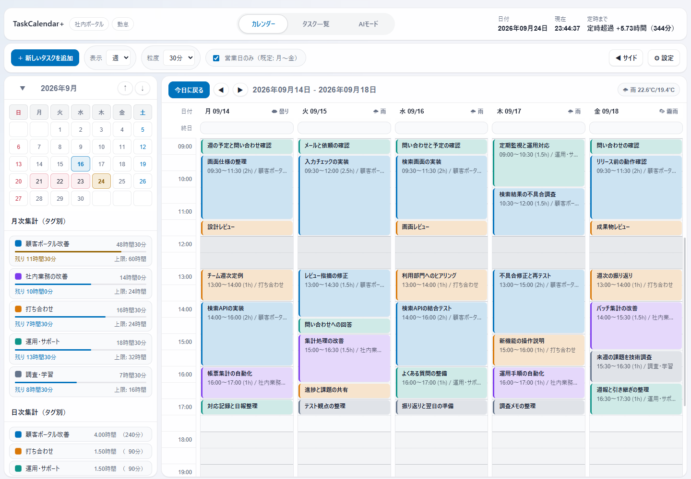
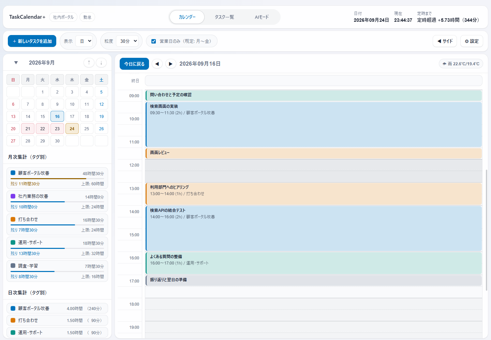
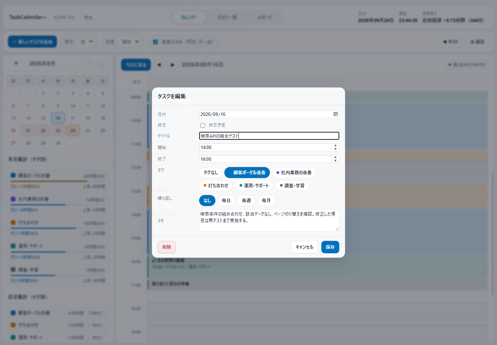
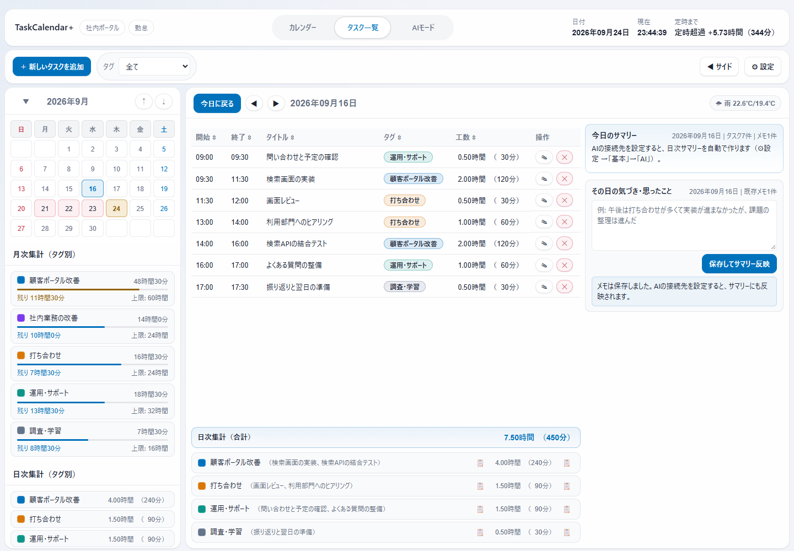
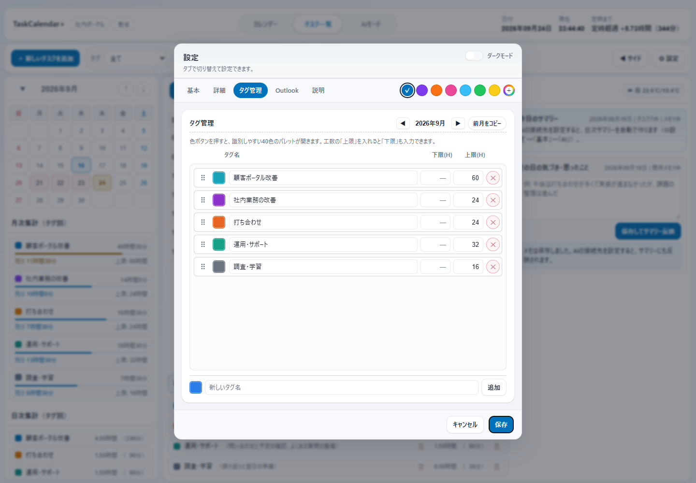
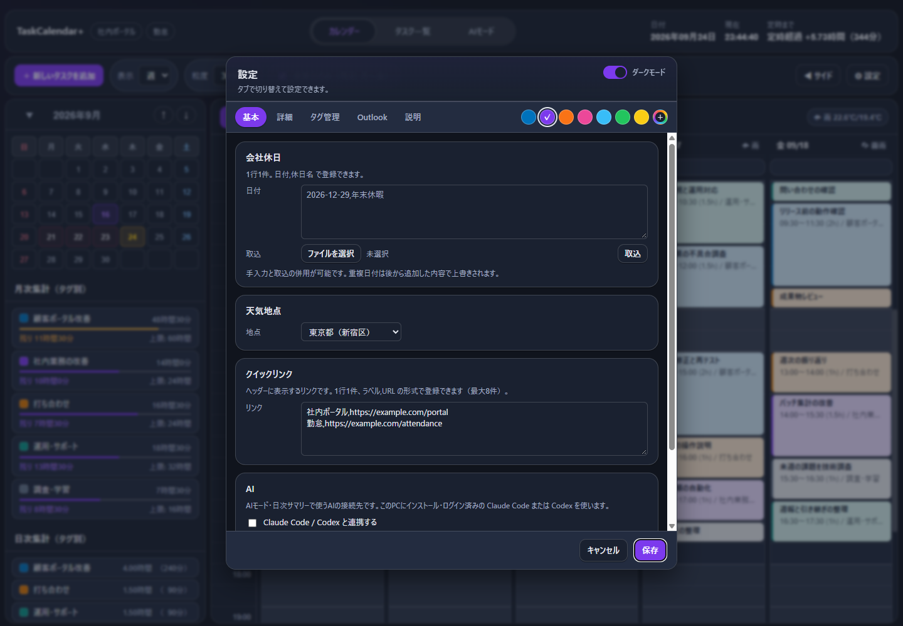

# TaskCalendar+

**予定を記録して、何にどれだけ時間を使ったかを見えるように。**

TaskCalendar+ は、毎日の予定や作業記録をカレンダーで管理し、タグ別の工数を日報や振り返りに使える Windows アプリです。

> 画面は架空の業務データを登録した実際のアプリです。2026年9月の14営業日・95件の予定を使用し、土日祝日は除外しています。タグ付きタスクの時間帯は重ならず、12:00〜13:00は昼休みとして空けています。

## こんな使い方ができます

- **今日の予定を整理する** — 作業・会議・問い合わせ対応を色分けして、時間の使い方を把握。
- **日報を作る** — その日の作業時間をタグ別にまとめ、コピーして転記。
- **月の工数を確認する** — タグごとの合計時間と、設定した上限までの残り時間を確認。

## 1. カレンダーで予定を入れる

「カレンダー」の表示を **日／週** に切り替えられます。週表示は全体の見通しに、日表示は一日の作業確認に便利です。

空いている時間をドラッグするか、**「＋ 新しいタスクを追加」**から予定を作成します。登録した予定は、ドラッグで移動したり、上下の端を動かして時間を調整したりできます。

予定には、日付・タイトル・開始／終了時刻・タグ・メモを登録できます。毎日・毎週・毎月の繰り返しにも対応しています。

既存の予定をダブルクリックすると編集画面が開きます。

**日付を探すときは**、左のミニカレンダーを使います。月名をクリックすると1〜12月を選べる画面に切り替わり、年も移動できます。月名の左のボタンでミニカレンダーを折りたたむこともできます。

## 2. 一日の作業を振り返る

「タスク一覧」では、開始・終了時刻、タイトル、タグ、工数をまとめて確認できます。見出しをクリックして並べ替えたり、タグで絞り込んだりできます。

画面下部には **一日の合計とタグ別の作業時間**を表示します。コピー用のボタンから、作業内容や時間を日報へ転記できます。

この例では、9:00〜17:30のうち昼休み1時間を除いた **7時間30分**を記録しています。

| タグ | その日の作業時間 |
|---|---:|
| 顧客ポータル改善 | 4時間 |
| 打ち合わせ | 1時間30分 |
| 運用・サポート | 1時間30分 |
| 調査・学習 | 30分 |

「その日の気づき・思ったこと」には、うまくいったことや翌日に引き継ぎたいことを残せます。AIを設定していなくてもメモは保存できます。日次サマリーの自動作成には、後述のAI設定が必要です。

## 3. タグで月の工数を管理する

**「設定」→「タグ管理」**で、案件名や作業の種類ごとにタグを作ります。色を変えたり、表示順を並べ替えたり、前月のタグ設定をコピーしたりできます。

タグに月の工数上限を設定すると、左側の月次集計で **使った時間と残り時間**を確認できます。

最初は「案件」「打ち合わせ」「運用」など、普段の日報に使っている分類から始めると整理しやすくなります。

## 自分に合った見た目・働き方に

設定画面の右上にある色見本で、ボタンや選択表示の色を変更できます。「＋」から好きな色を指定することもできます。色はその場でプレビューされ、**「保存」で確定、「キャンセル」で元に戻ります。**

次の項目も設定できます。

| 項目 | できること |
|---|---|
| ダークモード | 明るい画面／暗い画面の切り替え |
| 勤務時間・休憩 | 始業・終業時刻と休憩時間、休憩を工数に含めるかを設定 |
| 時間の粒度 | 15分・30分・60分から選択 |
| 営業日の表示 | カレンダーを平日のみの表示に切り替え |
| 会社休日 | 独自の休日を入力、またはファイルから取り込み |
| クイックリンク | 社内ポータルや勤怠など、よく使うページをヘッダーに登録 |
| URL自動オープン | 指定した時刻にページを開き、勤怠入力などを忘れにくくする |
| 起動・常駐 | ログイン時の自動起動や、閉じるボタンでタスクトレイへ格納する動作を設定 |

クイックリンクは「名前,URL」を1行に1件ずつ入力します。同じURLでも名前が異なれば、別のリンクとして登録できます。

## OutlookやAIと連携する

### Outlookの予定を取り込む

「設定」→「Outlook」で予定表を選び、**「Outlookから同期」**を押すと予定を取り込めます。一定間隔での自動同期も設定できます。

この機能には、PCにインストールされた **Outlookのクラシック版**が必要です。新しいOutlookには対応していません。

### AIに記録を振り返ってもらう

AIは任意の機能です。利用する場合は、Claude CodeまたはCodexを別途導入してログインし、「設定」→「基本」→「AI」で連携を有効にします。

接続先を選ぶとモデル候補が表示されます。「既定を使用」で任せることも、候補からモデルを選ぶこともできます。

入力欄の「Enterで送信」は、初期状態ではOFFです。OFFではEnterで改行・Ctrl+Enterで送信、ONではEnterで送信・Shift+Enterで改行できます。切り替えた設定は保存されます。

AIモードでは、たとえば次のように質問できます。

- 「今週、打ち合わせに何時間使った？」
- 「先週の水曜日は何をしていた？」
- 「今月、案件の工数はどれくらい残っている？」
- 「明日の15時から16時にレビューを入れて」

予定の追加・変更・削除は、AIの提案を確認して **「確定」したときだけ**反映されます。

AIを利用すると、質問に応じて予定やメモの内容が選択したAIサービスへ送信されます。カレンダー・タスク一覧・工数集計は、AIを設定しなくても使えます。

## データを守る・移す

予定や設定は、このPC内に保存されます。

「設定」→「説明」から、目的に応じて書き出せます。

- **設定のエクスポート**：表示や勤務時間などの設定とタグを移したいとき。
- **全データのバックアップ**：予定・タグ・設定・日次サマリー・気づきメモをまとめて保存したいとき。

復元すると現在のデータが置き換わるため、PCの移行やサンプルの読み込み前には、現在の全データをバックアップしてください。

### 画面と同じサンプルを試す

[サンプルデータをダウンロード](docs/examples/sample-backup.json)して、「設定」→「説明」→「全データのバックアップ／復元」から読み込めます。読み込んだ後は、ミニカレンダーで **2026年9月16日**を選ぶと、このREADMEの日表示・タスク一覧と同じ内容を確認できます。

サンプルは5タグ・95件、合計105時間の架空データです。AI連携・Outlook自動同期・URL自動オープンは無効にしてあります。

## 利用環境と配布について

Windows 10／11（64ビット）とMicrosoft Edge WebView2ランタイムが必要です。画面は日本語で、日本の祝日・日本時間を前提としています。

インストーラーは [GitHub Releases](https://github.com/t-ueda21/TaskCalendar-Plus/releases) で配布します。公開済みのバージョンから、名前が `x64-setup.exe` で終わるファイルをダウンロードして起動してください。初回公開前はダウンロードできるファイルが表示されません。

インストール後は「設定」→「説明」→「アップデート」から最新版を確認できます。起動時にも確認し、新しいバージョンがあるときだけ「更新」ボタンを表示します。起動時の確認は設定でOFFにできます。

更新前に、編集中の予定や設定を保存して閉じてください。「更新して再起動」を押すと、ダウンロードしたファイルを検証し、保存済みデータを自動バックアップしてから更新します。

Windowsのコード署名は付けていないため、ダウンロードや初回起動時にWindowsの警告が表示される場合があります。会社のPCでは、管理者の設定により実行できない場合があります。

## ライセンス

[MIT License](LICENSE)
