# TaskCalendar+

> このブランチは **v3.0.0-pre.2** のソースです。[確認用プレリリース](https://github.com/t-ueda21/TaskCalendar-Plus/releases/tag/v3.0.0-pre.2)は手動ダウンロード用で、通常のアプリ内更新通知の対象には含めません。以下の操作説明は3.0系に合わせています。[変更内容](docs/releases/v3.0.0.md)、[スクリーンショット](docs/screenshots-v3.0.0.md)、[Issue別の実施報告](docs/reviews/v3.0.0-issues.md)も確認できます。「最新版」へのダウンロードリンクは正式版を指します。

**予定を入れる。作業時間を見渡す。日報にまとめる。**

Pre.2は[EXE](https://github.com/t-ueda21/TaskCalendar-Plus/releases/download/v3.0.0-pre.2/TaskCalendar%2B_3.0.0-pre.2_x64-setup.exe)／[インストーラー入りZIP](https://github.com/t-ueda21/TaskCalendar-Plus/releases/download/v3.0.0-pre.2/TaskCalendar%2B_3.0.0-pre.2_x64-setup.zip)から手動で取得できます。[再公開の変更内容](docs/releases/v3.0.0-pre.2.md)を確認してください。ZIPは展開後にインストーラーを実行します。

TaskCalendar+ は、予定と作業記録をカレンダーで管理する Windows アプリです。案件や作業の種類ごとにタグを付けると、一日・一か月の工数を集計できます。

[Windows版をダウンロード](https://github.com/t-ueda21/TaskCalendar-Plus/releases/latest) ・ [変更履歴](CHANGELOG.md) ・ [サンプルデータ](docs/examples/sample-backup.json)

<a href="docs/images/v3.0.0-review/calendar-week.png">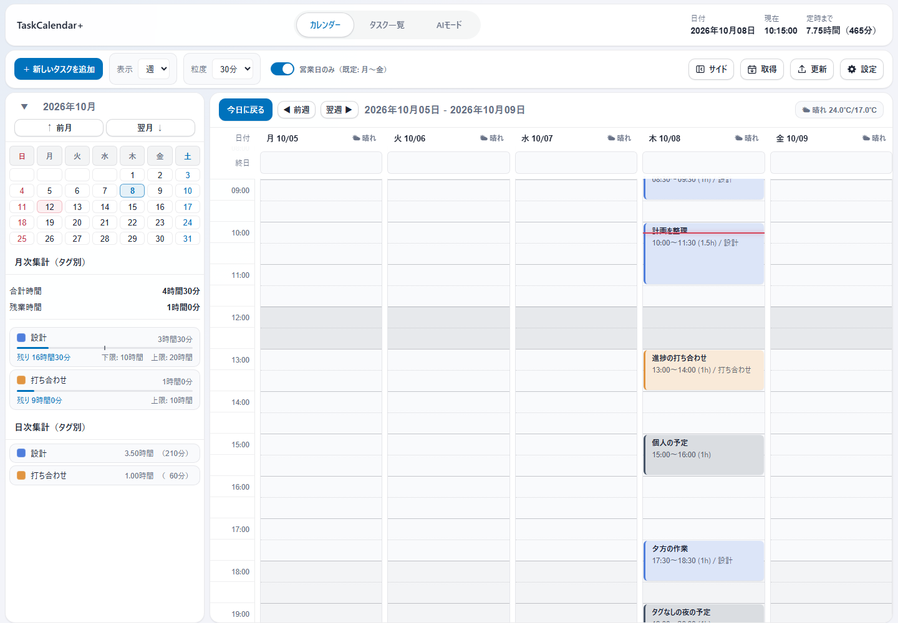</a>

> v3.0.0の画像は、アプリの画面コードを隔離したChromiumで表示したものです。予定・タグは架空のデータで、日時は2026年10月8日10時15分、天気も固定しています。API・ネイティブ連携の応答は検証用です。Windows版の再起動試験や、実Outlook・実AIへの接続を示す画像ではありません。工数上限・下限の2枚は、明記したv0.2.0の例を残しています。

## まずは3ステップ

1. **インストールする** — [最新版](https://github.com/t-ueda21/TaskCalendar-Plus/releases/latest)から、名前が `x64-setup.exe` で終わるファイルをダウンロードして起動します。
2. **働き方を設定する** — 「設定」→「勤務時間と休日」で勤務時間・休憩を確認し、「タグ管理」で案件名や作業の種類を登録します。
3. **予定を入れる** — 「＋ 新しいタスクを追加」で日付・タイトル・時刻・タグを入力して保存します。タグが決まっていなければ、タグなしでも登録できます。

予定の管理と工数集計は、OutlookやAIを設定せずに使えます。

## 画面の使い分け

| 場所 | できること |
|---|---|
| **カレンダー** | 日・週の予定を見ながら、追加・移動・時間調整 |
| **タスク一覧** | 一日の記録を一覧で確認し、タグ別の時間を日報へコピー |
| **AIモード** | 記録について質問したり、予定の追加・変更を依頼 |
| **サイド** | 左のミニカレンダーと集計欄を表示・非表示 |
| **取得** | Outlookの取り込み設定を開く |
| **更新** | アプリの新しいバージョンを確認 |
| **設定** | 勤務時間、タグ、見た目、連携、バックアップを設定 |

## 予定を作る・動かす

カレンダーの「表示」で **日／週** を切り替えます。一日の時間配分を見るなら日表示、一週間の予定を見渡すなら週表示が便利です。

<a href="docs/images/v3.0.0-review/calendar-day.png">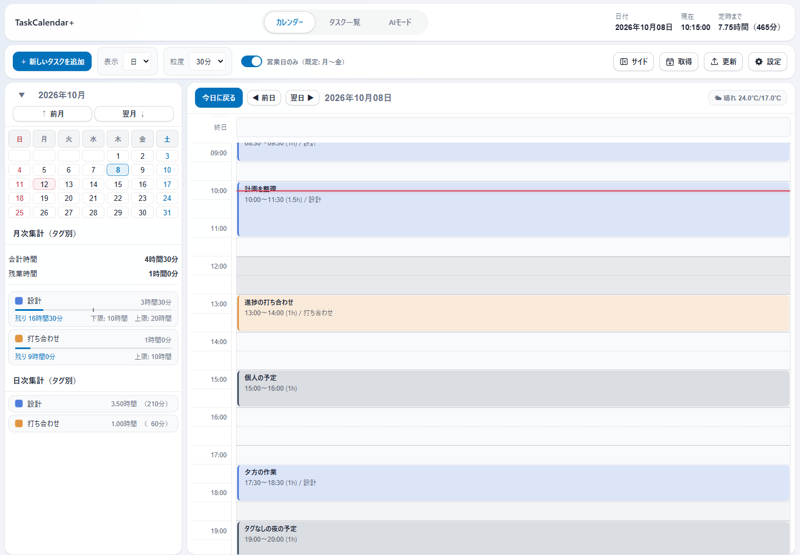</a>

| やりたいこと | 操作 |
|---|---|
| 予定を追加する | 「＋ 新しいタスクを追加」、または空いている時間帯をドラッグ |
| 内容を編集する | 予定をダブルクリック |
| 時刻を移動する | 予定をドラッグ |
| 長さを変える | 予定の上端・下端をドラッグ |
| 別の日を開く | 左のミニカレンダーで日付を選ぶ |
| 別の月・年へ移動する | 月名をクリックすると月選択、さらに見出しをクリックすると年選択。年→月→日の順に選ぶ。年選択は12年ずつ移動できる |
| 今日へ戻る | 右側の「今日に戻る」を押す。ミニカレンダーが年・月選択中でも今日の日付に戻る |
| 前後の日・週へ移動する | 「前日／翌日」「前週／翌週」を押す |
| 左側を広く使う | 月名の左の「▼」でミニカレンダーを折りたたむ |

予定には、日付・タイトル・開始／終了時刻・タグ・メモを登録できます。終日予定や、毎日・毎週・毎月の繰り返しにも対応しています。

<a href="docs/images/v3.0.0-review/task-edit.png">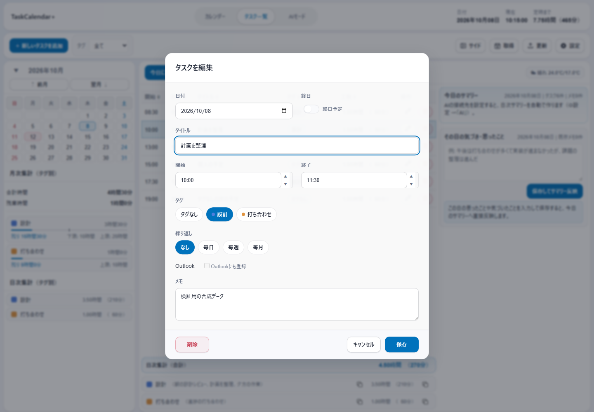</a>

「Outlookにも登録」はタスクごとに選択します。初期状態はOFFで、「設定」→「Outlook」から既定ONにもできます。連携したタスクの編集・削除もOutlookに反映します。右クリックのタグ選択は、文字と色見本を分けて表示します。[年選択](docs/images/v3.0.0-review/mini-year.png)・[月選択](docs/images/v3.0.0-review/mini-month.png)・[タグ選択](docs/images/v3.0.0-review/tag-menu.png)の画面も確認できます。

ミニカレンダー上でホイールを回すと、日付表示では月、月選択では年、年選択では年のページを移動できます。折りたたみの矢印と年月の選択は別のボタンです。

キー操作の一覧は「設定」→「ショートカット」で確認できます。コピー・貼り付け、表示倍率、AI送信などの使える場面も掲載しています。

## 複数の予定をまとめて変更する

1. **Ctrl＋クリック**で予定を選択・解除します。**Shift＋クリック**では、表示順の範囲を選択します。
2. 選択中の予定のどれかを**右クリック**し、タグを選ぶと、選択中の全件へ同じタグを設定できます。「タグなし」も一括適用できます。
3. 日付・メモもまとめて変えたい場合は、同じ右クリックメニューの「一括変更」を使い、変更する項目だけを選んで「○件に適用」を押します。
4. まとめて削除する場合は、右クリックメニューの「選択した○件を削除…」を選び、件数を確認して削除します。

複数選択しても操作欄やボタンは追加表示せず、画面の配置は変わりません。選択件数は右クリックメニュー内に表示します。メニューに「選択解除」は置かず、Ctrl＋クリックで個別解除、Escで全解除できます。

選んでいない予定や、指定していない項目は維持します。選択していない予定を右クリックした場合は、その1件だけを対象にします。繰り返し予定の変更・一括削除も選択した回だけが対象です。他の操作で内容が変わっていた場合は競合を表示し、一部だけの変更・削除を避けます。

<a href="docs/images/v3.0.0-review/task-bulk-edit.png">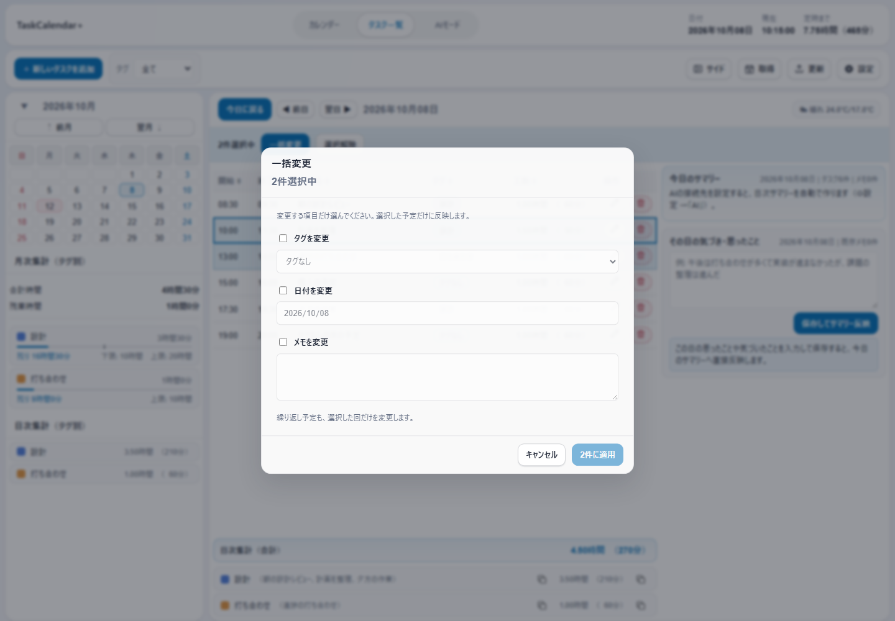</a>

## 工数バーの見方

工数は、**登録した予定の開始・終了時刻と休憩設定から計算した時間**です。月次集計には、その月に登録したこれからの予定も含まれます。

ミニカレンダー下の月次には、**合計時間と残業時間**を表示します。日次欄はタグ別の時間だけを表示します。タグなし・削除されたタグの予定は合計と残業に含めず、同日の重なった時間を二重に数えず、工数に含めない休憩を除きます。残業は設定した勤務時間帯の外（早出・終業後）の時間で、月次は日ごとの残業時間を合算します。休日も同じ勤務時間帯を基準にし、時間を持たない終日予定は0分として扱います。

タグには「下限と上限」「上限のみ」「設定なし」を指定できます。下の画像では、範囲内・下限未達・上限のみ・超過・設定なしを、一つの集計欄で見比べられます。

> この工数バーと次のタグ管理画像・数値表は、v0.2.0の架空データによる例です。

<a href="docs/images/monthly-budgets.png">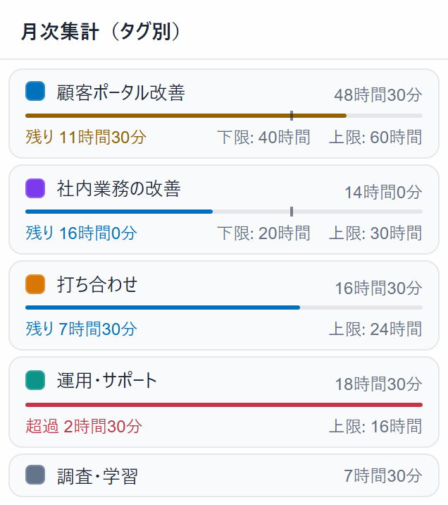</a>

| 状態 | タグ | 設定 | 登録時間 | 見方 |
|---|---|---|---|---|
| **上下限あり・範囲内** | 顧客ポータル改善 | 下限40時間／上限60時間 | 48時間30分 | 下限の線を越え、上限まで残り11時間30分 |
| **上下限あり・下限未達** | 社内業務の改善 | 下限20時間／上限30時間 | 14時間 | 下限の線より手前。下限まで6時間 |
| **上限のみ** | 打ち合わせ | 上限24時間 | 16時間30分 | 上限まで残り7時間30分 |
| **上限超過** | 運用・サポート | 上限16時間 | 18時間30分 | 赤いバーで「超過 2時間30分」を表示 |
| **設定なし** | 調査・学習 | 上下限なし | 7時間30分 | 時間だけを表示し、バーは表示しない |

バーの縦線は下限の目安です。**「残り」は上限まで使える時間**を示します。上限の80%以上になると注意色、上限を超えると赤色になります。

### 下限・上限を設定する

「設定」→「タグ管理」で、対象の月とタグを確認します。**先に上限を入力すると、下限も入力できるようになります。** 数値の単位は時間で、下限は上限より小さく設定します。上限を空欄にすると上下限なしになります。

<a href="docs/images/tag-budgets.png">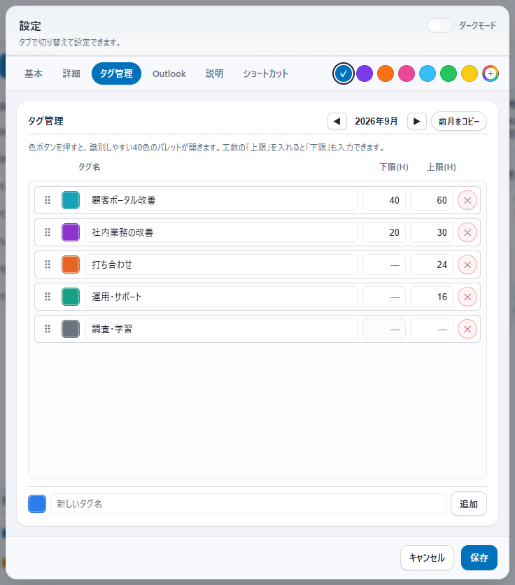</a>

タグの色や表示順も変更できます。次の月も同じタグを使う場合は「前月をコピー」が便利です。

## 一日の記録を日報に使う

「タスク一覧」では、開始・終了時刻、タイトル、タグ、工数を確認できます。見出しをクリックすると並べ替え、上部の「タグ」で絞り込みができます。

<a href="docs/images/v3.0.0-review/tasks.png">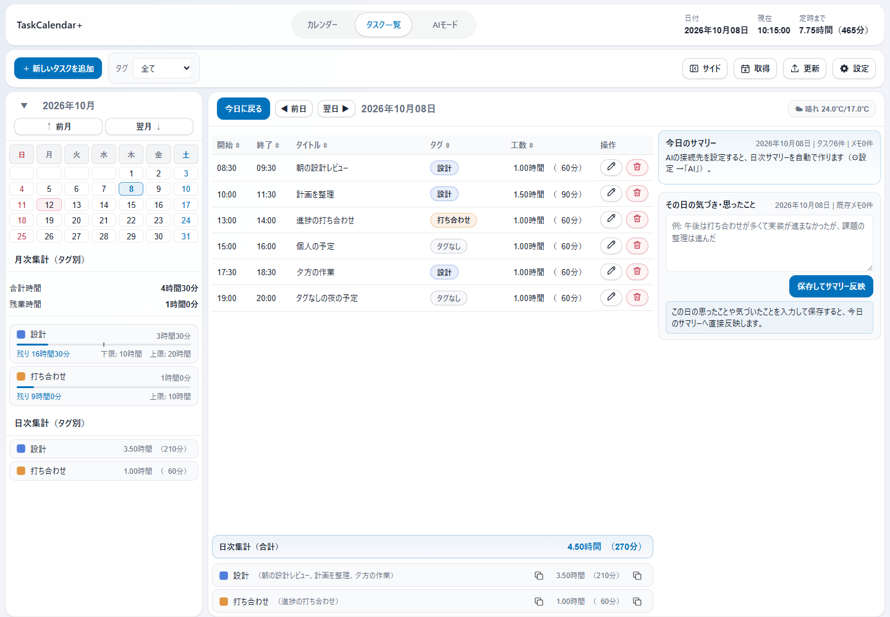</a>

この日の例は、**6件の予定のうちタグ付き4件で合計4時間30分、勤務時間9:00〜18:00の外に1時間**です。タグなし2件は一覧に表示しますが、合計・残業には含めません。画面下部の日次集計にある線画のコピー用ボタンから、作業内容や時間を日報へ転記できます。

「その日の気づき・思ったこと」には、うまくいったことや翌日に引き継ぎたいことを入力して保存できます。メモの保存はAIなしでも使えます。「今日のサマリー」をAIに作成してもらう場合は、AI連携の設定が必要です。

## 見た目・勤務時間を自分に合わせる

「設定」→「表示」でダークモードと配色を選べます。色見本の「＋」から好きな色も指定できます。配色はプレビュー後に「保存」で確定し、「キャンセル」で元に戻ります。

ダークモードとタグ・工数の変更は、その場で保存されます。その他の設定は「保存」で確定します。設定ページは上下／左右キー・Home・Endでも切り替えられ、タグの並べ替えボタンは上下キーでも操作できます。狭い画面ではサイドバーを初期状態で折りたたみ、「サイド」から開けます。

<a href="docs/images/v3.0.0-settings/settings-work-dark.png">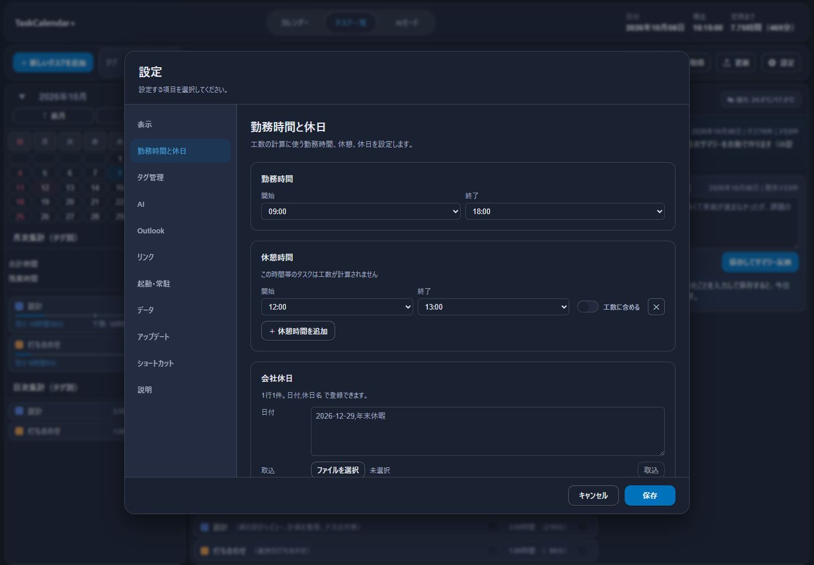</a>

「設定」→「表示」→「表示言語」で、PCに合わせるか、**日本語・English・한국어・简体中文・繁體中文・Español・Français・Deutsch・Português**を指定できます。AIの回答にも同じ言語を使います。言語を変更しても、日本の祝日・地域設定や入力したタスク名・メモ・タグ名は変わりません。未対応のPC言語は日本語になります。[言語設定](docs/images/v3.0.0-settings/settings-display.png)・[英語](docs/images/v3.0.0-review/calendar-en.png)・[韓国語](docs/images/v3.0.0-review/calendar-ko.png)の画面も確認できます。

設定は目的別の**11ページ**に分かれています。

| ページ | 内容 |
|---|---|
| **表示** | テーマ・カラー・言語・時間粒度・営業日のみ・天気地点 |
| **勤務時間と休日** | 勤務開始・終了、休憩と工数算入、会社休日 |
| **タグ管理** | 追加・変更・削除、色、順序、月別工数上下限 |
| **AI** | 接続先、モデル、接続設定、話し方・カスタム指示 |
| **Outlook** | 取得・同期・登録、反映状況・再試行 |
| **リンク** | クイックリンク、指定時刻のURL自動オープン |
| **起動・常駐** | ログイン時起動、トレイ格納、起動時の表示状態 |
| **データ** | 設定移行、全データのバックアップ・復元 |
| **アップデート** | 現在のバージョン、更新確認・実行、起動時の更新確認 |
| **ショートカット** | キー操作と使用条件 |
| **説明** | アプリ概要、機能紹介、GitHubへのリンク |

「設定」→「リンク」のクイックリンクは「名前,URL」を1行に1件ずつ入力します。同じURLでも名前が違えば、別のリンクとして登録できます。

通知領域のアプリアイコンを右クリックすると、「最小化」「リロード」「再起動」「閉じる」を選べます。「最小化」はウィンドウを隠してトレイに格納し、「閉じる」はアプリを終了します。アイコンを左クリックすると、アプリの画面を再表示します。

アプリをもう一度起動した場合は、既存のウィンドウを表示します。同じアプリを二重に起動しません。

## Outlookの予定を取り込む

**PCにインストールされたOutlookのクラシック版が必要です。新しいOutlookには対応していません。**

1. ツールバーの「取得」を押します。「設定」→「Outlook」からも開けます。
2. 予定表名、タグ、取得方法を指定します。「現在時刻以降」は今から先に開始する予定を対象にします。「期間指定」は開始日と終了日を選択し、両端の日付を含めて最大366日取得できます。「今週」「今月」「表示中の週」も選べます。
3. 「今すぐ取得」を押します。定期的に取り込む場合は「自動同期」をONにして、間隔を選びます。

<a href="docs/images/v3.0.0-settings/settings-outlook.png">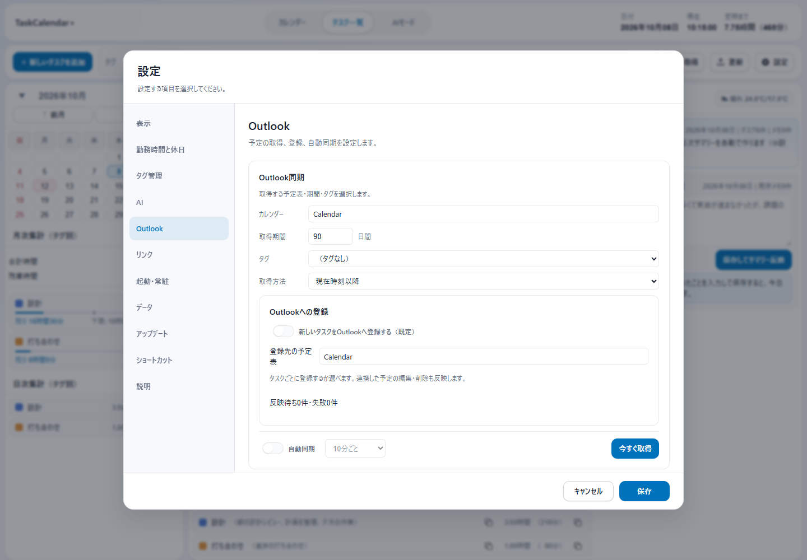</a>

Outlookで削除・キャンセルされた予定は、次の正常な同期で、取得期間内の取り込み済み予定にも反映されます。手動で作成した予定は同期による削除の対象になりません。取得が途中で失敗した場合は、既存の予定を変更せずに同期を中止します。

自動同期は現在時刻以降を取得します。開始済みの予定と当日の終日予定は新規取得から外れますが、取り込み済みの過去予定はその理由だけで削除しません。

アプリからOutlookへ登録した連携タスクは、アプリ側の記録を正とします。Outlookでそのタスクを変更・削除しても、逆方向には同期しません。登録・編集・削除の反映待ちや失敗は「設定」→「Outlook」で確認し、失敗時は再試行できます。

## AIに記録を振り返ってもらう

「設定」→「AI」→「AIの話し方」で、**温かさ・絵文字の量・回答の長さ・口調・カスタム指示**を調整できます。AIチャットと日次サマリーの両方に適用し、「回答例を確認」で話し方を試せます。表示言語と同じ言語で回答します。

<a href="docs/images/v3.0.0-settings/settings-ai.png">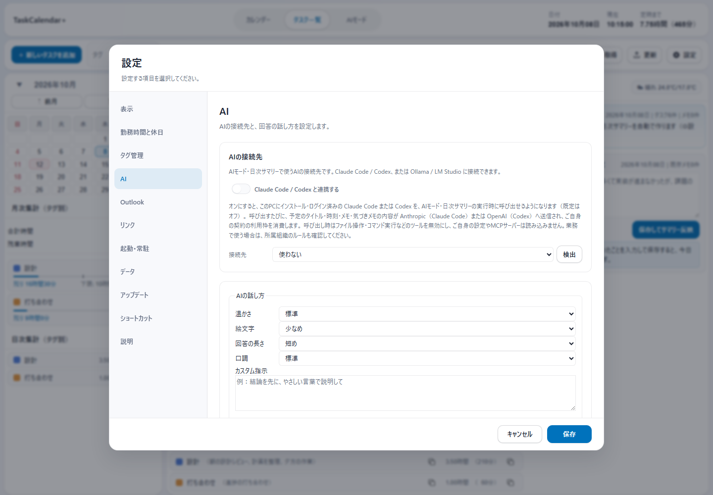</a>

Claude CodeまたはCodexを使う場合は、別途導入してログインし、「設定」→「AI」で連携を有効にします。接続先を選び、モデルは「既定を使用」または表示された候補から選択します。

Ollama／LM Studioを使う場合は、サーバーを起動してモデルを用意し、「設定」→「AI」で接続先を選びます。Claude Code／Codexの連携スイッチは不要です。

| 接続先 | 接続URLの初期値 |
|---|---|
| Ollama | `http://localhost:11434/v1` |
| LM Studio | `http://localhost:1234/v1` |

「再取得」でモデル候補を取得し、プルダウンから選びます。一覧にないモデルは「モデル名を手入力…」から入力できます。「接続テスト」で接続と道具の呼び出しを確認し、「保存」するとAIモードと日次サマリーに使えます。接続テストには予定データを使いません。通常のAI利用では、必要な予定・メモを指定した接続先へ送ります。このPC内で処理したい場合は、localhostのサーバーとローカルモデルを選んでください。認証が必要なサーバーへの接続には、まだ対応していません。

予定検索・集計・変更提案には、道具の呼び出しに対応したモデルを使ってください。接続テストの成功は、回答内容の正確さを保証するものではありません。

たとえば、次のように質問できます。

- 「今週、打ち合わせに何時間使った？」
- 「先週の水曜日は何をしていた？」
- 「今月、案件の工数はどれくらい残っている？」
- 「明日の15時から16時にレビューを入れて」

予定の追加・変更・削除は、**提案を確認して「確定」を押したときだけ**反映されます。AIの利用時には、質問に応じて予定やメモの内容が、選択したAIの接続先へ送信されます。

「Enterで送信」は初期状態ではOFFです。OFFではEnterで改行・Ctrl+Enterで送信、ONではEnterで送信・Shift+Enterで改行できます。

## データをバックアップする・別のPCへ移す

予定や設定はこのPC内に保存されます。「設定」→「データ」から書き出せます。

| 操作 | 含まれるもの |
|---|---|
| **設定のエクスポート** | 表示・勤務時間などの設定とタグ |
| **全データのバックアップ** | 予定、タグ、設定、日次サマリー、気づきメモ |

別のPCに予定も移したい場合は、全データのバックアップを使います。**復元すると現在のデータが置き換わるため、先に現在の全データをバックアップしてください。**

書き出しと読み込みは別の欄に分かれています。読み込みは **1. ファイルを選択 → 2. 表示された内容を確認 → 3. インポートまたは復元を実行** の順です。形式を確認できないファイルは実行できません。復元前には現在のデータの置き換えを確認します。バックアップ復元はOutlookへの書き込みリンクを引き継がず、元の予定表を変更しません。

<a href="docs/images/v3.0.0-settings/settings-data.png">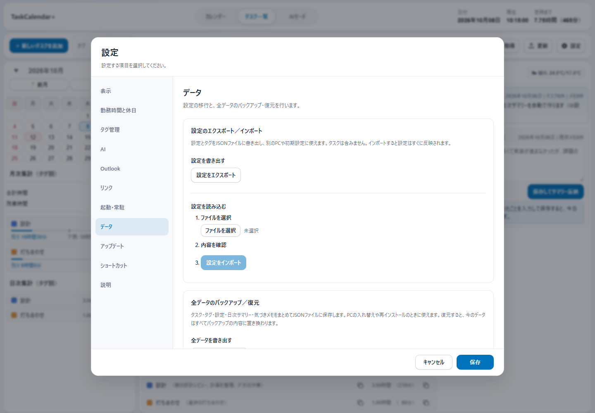</a>

### 工数バーの説明用サンプルを試す

[サンプルデータ](docs/examples/sample-backup.json)を開き、GitHubのダウンロードボタンから `sample-backup.json` を保存します。「設定」→「データ」の全データ復元から読み込み、ミニカレンダーで **2026年9月16日**を選んでください。

サンプルは **14営業日・95件・5タグ・合計105時間**です。土日祝日と昼休みを避け、タグ付き予定の時間帯は重ねていません。工数の上下限も画像と同じ5パターンで設定済みです。AI連携・Outlook自動同期・URL自動オープン・起動時の更新確認はOFFです。

## アプリを更新する

ツールバーの「更新」、または「設定」→「アップデート」で確認できます。新しいバージョンがあると、更新ボタンの色が変わります。起動時の確認がONなら、更新内容のお知らせも開きます。

更新があるときは、マウスを重ねても強調色を保ちます。標準の青では、背景が少し濃い青に変わり、文字とアイコンは白のままです。

編集中の予定を保存して閉じ、「更新して再起動」で進みます。設定画面からは「設定を保存して更新」で進めます。アプリは更新ファイルを検証し、保存済みデータを自動バックアップしてから更新します。

## 利用環境

Windows 10／11（64ビット）とMicrosoft Edge WebView2ランタイムが必要です。画面は9言語に対応し、日本の祝日・日本時間を前提としています。

Windowsのコード署名は付けていないため、ダウンロードや初回起動時にWindowsの警告が表示される場合があります。会社のPCでは、管理者の設定により実行できない場合があります。

[変更履歴](CHANGELOG.md) ・ [設定11ページの変更・検証結果](docs/reviews/v3.0.0-settings-mece.md) ・ [MIT License](LICENSE)
