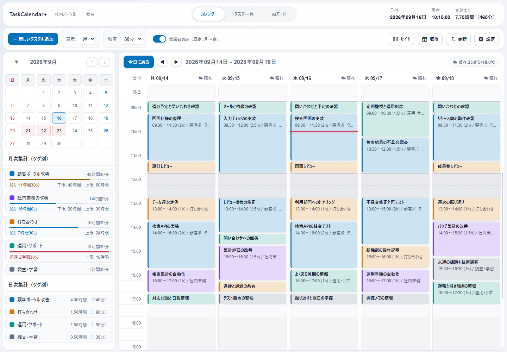
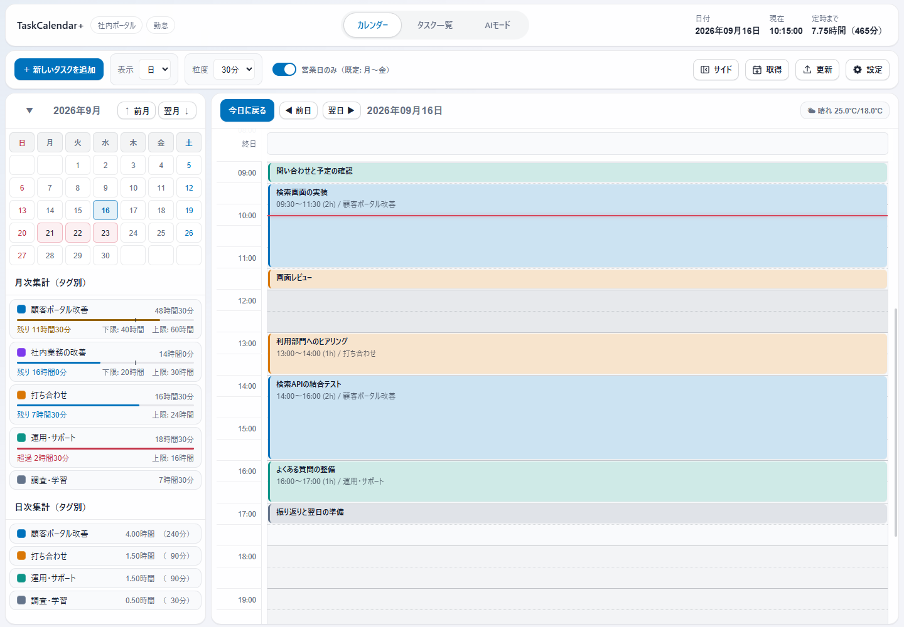
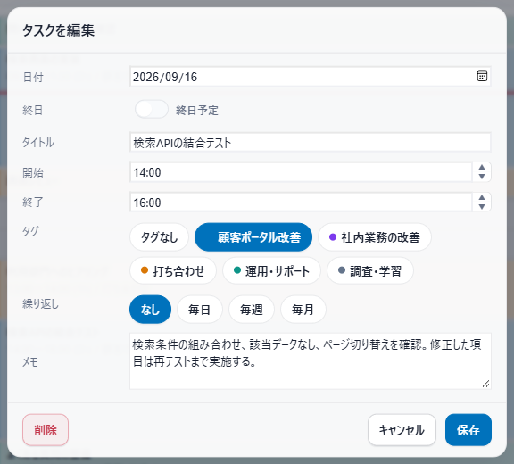
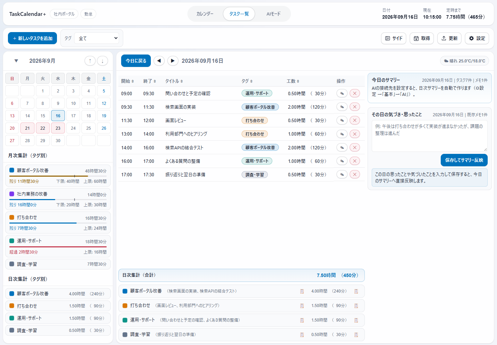
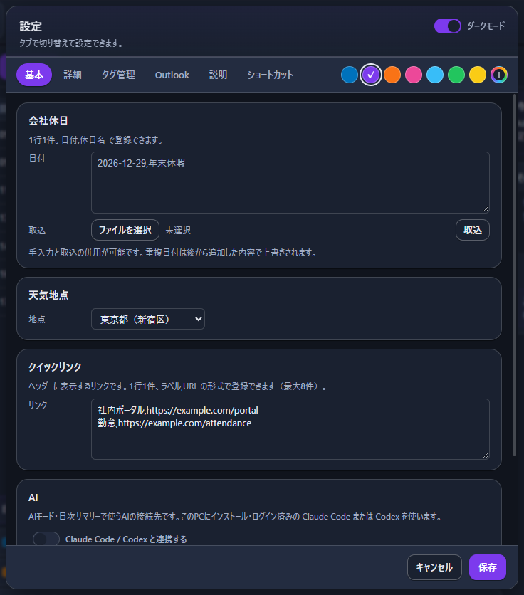
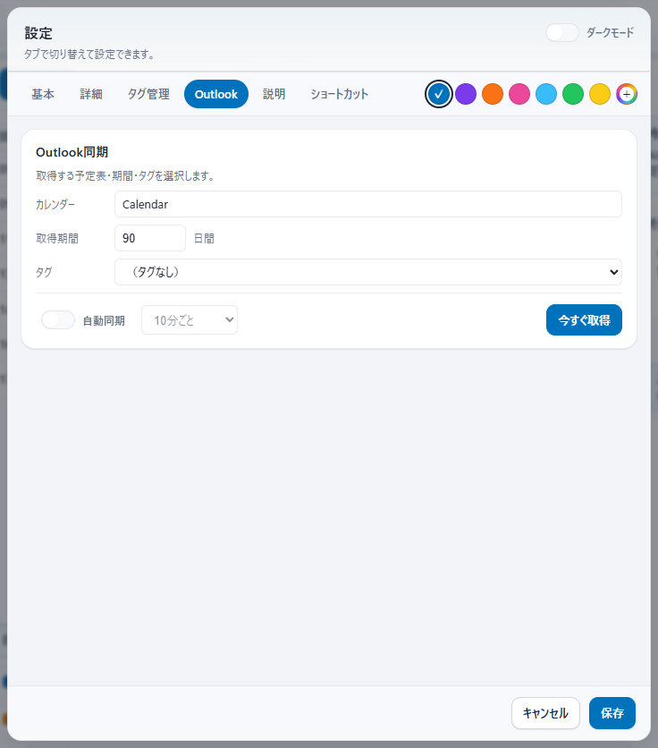

# TaskCalendar+

**予定を入れる。作業時間を見渡す。日報にまとめる。**

TaskCalendar+ は、予定と作業記録をカレンダーで管理する Windows アプリです。案件や作業の種類ごとにタグを付けると、一日・一か月の工数を集計できます。

[Windows版をダウンロード](https://github.com/t-ueda21/TaskCalendar-Plus/releases/latest) ・ [変更履歴](CHANGELOG.md) ・ [サンプルデータ](docs/examples/sample-backup.json)

> 画像は v0.1.6 の実際の画面です。架空の業務データを使い、2026年9月16日を表示しています。時計と天気も撮影用に固定しています。画像をクリックすると元の大きさで確認できます。

## まずは3ステップ

1. **インストールする** — [最新版](https://github.com/t-ueda21/TaskCalendar-Plus/releases/latest)から、名前が `x64-setup.exe` で終わるファイルをダウンロードして起動します。
2. **働き方を設定する** — 「設定」→「詳細」で勤務時間・休憩を確認し、「タグ管理」で案件名や作業の種類を登録します。
3. **予定を入れる** — 「＋ 新しいタスクを追加」で日付・タイトル・時刻・タグを入力して保存します。タグが決まっていなければ、タグなしでも登録できます。

予定の管理と工数集計は、OutlookやAIを設定せずに使えます。

## 画面の使い分け

| 場所 | できること |
|---|---|
| **カレンダー** | 日・週の予定を見ながら、追加・移動・時間調整 |
| **タスク一覧** | 一日の記録を一覧で確認し、タグ別の時間を日報へコピー |
| **AIモード** | 記録について質問したり、予定の追加・変更を依頼 |
| **サイド** | 左のミニカレンダーと集計欄を表示・非表示 |
| **取得** | Outlookの取り込み設定を開く |
| **更新** | アプリの新しいバージョンを確認 |
| **設定** | 勤務時間、タグ、見た目、連携、バックアップを設定 |

## 予定を作る・動かす

カレンダーの「表示」で **日／週** を切り替えます。一日の時間配分を見るなら日表示、一週間の予定を見渡すなら週表示が便利です。

| やりたいこと | 操作 |
|---|---|
| 予定を追加する | 「＋ 新しいタスクを追加」、または空いている時間帯をドラッグ |
| 内容を編集する | 予定をダブルクリック |
| 時刻を移動する | 予定をドラッグ |
| 長さを変える | 予定の上端・下端をドラッグ |
| 別の日を開く | 左のミニカレンダーで日付を選ぶ |
| 別の月へ移動する | ミニカレンダーの月名をクリックして月を選ぶ |
| 左側を広く使う | 月名の左の「▼」でミニカレンダーを折りたたむ |

予定には、日付・タイトル・開始／終了時刻・タグ・メモを登録できます。終日予定や、毎日・毎週・毎月の繰り返しにも対応しています。

## 工数バーの見方

工数は、**登録した予定の開始・終了時刻と休憩設定から計算した時間**です。月次集計には、その月に登録したこれからの予定も含まれます。

タグには「下限と上限」「上限のみ」「設定なし」を指定できます。下の画像では、範囲内・下限未達・上限のみ・超過・設定なしを、一つの集計欄で見比べられます。

| 状態 | タグ | 設定 | 登録時間 | 見方 |
|---|---|---|---|---|
| **上下限あり・範囲内** | 顧客ポータル改善 | 下限40時間／上限60時間 | 48時間30分 | 下限の線を越え、上限まで残り11時間30分 |
| **上下限あり・下限未達** | 社内業務の改善 | 下限20時間／上限30時間 | 14時間 | 下限の線より手前。下限まで6時間 |
| **上限のみ** | 打ち合わせ | 上限24時間 | 16時間30分 | 上限まで残り7時間30分 |
| **上限超過** | 運用・サポート | 上限16時間 | 18時間30分 | 赤いバーで「超過 2時間30分」を表示 |
| **設定なし** | 調査・学習 | 上下限なし | 7時間30分 | 時間だけを表示し、バーは表示しない |

バーの縦線は下限の目安です。**「残り」は上限まで使える時間**を示します。上限の80%以上になると注意色、上限を超えると赤色になります。

### 下限・上限を設定する

「設定」→「タグ管理」で、対象の月とタグを確認します。**先に上限を入力すると、下限も入力できるようになります。** 数値の単位は時間で、下限は上限より小さく設定します。上限を空欄にすると上下限なしになります。

タグの色や表示順も変更できます。次の月も同じタグを使う場合は「前月をコピー」が便利です。

## 一日の記録を日報に使う

「タスク一覧」では、開始・終了時刻、タイトル、タグ、工数を確認できます。見出しをクリックすると並べ替え、上部の「タグ」で絞り込みができます。

この日の例は、**9:00〜17:30、昼休み1時間を除いて7時間30分**です。画面下部の日次集計にあるコピー用ボタンから、作業内容や時間を日報へ転記できます。

「その日の気づき・思ったこと」には、うまくいったことや翌日に引き継ぎたいことを入力して保存できます。メモの保存はAIなしでも使えます。「今日のサマリー」をAIに作成してもらう場合は、AI連携の設定が必要です。

## 見た目・勤務時間を自分に合わせる

設定画面の右上でダークモードと配色を選べます。色見本の「＋」から好きな色も指定できます。配色はプレビュー後に「保存」で確定し、「キャンセル」で元に戻ります。

| 設定 | 使い方 |
|---|---|
| 勤務時間・休憩 | 始業・終業時刻、休憩時間、休憩を工数に含めるかを設定 |
| 時間の粒度 | カレンダーの時間枠を15分・30分・60分に切り替え |
| 営業日のみ | 設定した勤務曜日をカレンダーに表示 |
| 会社休日 | 独自の休日を「日付,休日名」で登録、またはファイルから取り込み |
| 天気地点 | 天気を表示する地域を選択 |
| クイックリンク | 社内ポータルや勤怠などのリンクを上部に登録 |
| URL自動オープン | 指定した時刻に、登録したページを開く |
| 起動・常駐 | Windowsログイン時の自動起動や、閉じたときのトレイ格納を設定 |

クイックリンクは「名前,URL」を1行に1件ずつ入力します。同じURLでも名前が違えば、別のリンクとして登録できます。

## Outlookの予定を取り込む

**PCにインストールされたOutlookのクラシック版が必要です。新しいOutlookには対応していません。**

1. ツールバーの「取得」を押します。「設定」→「Outlook」からも開けます。
2. 予定表名、取得する日数、取り込む予定に付けるタグを指定します。
3. 「今すぐ取得」を押します。定期的に取り込む場合は「自動同期」をONにして、間隔を選びます。

Outlookで削除・キャンセルされた予定は、次の正常な同期で、取得期間内の取り込み済み予定にも反映されます。手動で作成した予定は同期による削除の対象になりません。取得が途中で失敗した場合は、既存の予定を変更せずに同期を中止します。

## AIに記録を振り返ってもらう

AIを使う場合は、Claude CodeまたはCodexを別途導入してログインし、「設定」→「基本」→「AI」で連携を有効にします。接続先を選び、モデルは「既定を使用」または表示された候補から選択します。

たとえば、次のように質問できます。

- 「今週、打ち合わせに何時間使った？」
- 「先週の水曜日は何をしていた？」
- 「今月、案件の工数はどれくらい残っている？」
- 「明日の15時から16時にレビューを入れて」

予定の追加・変更・削除は、**提案を確認して「確定」を押したときだけ**反映されます。AIの利用時には、質問に応じて予定やメモの内容が、選択したAIサービスへ送信されます。

「Enterで送信」は初期状態ではOFFです。OFFではEnterで改行・Ctrl+Enterで送信、ONではEnterで送信・Shift+Enterで改行できます。

## データをバックアップする・別のPCへ移す

予定や設定はこのPC内に保存されます。「設定」→「説明」から書き出せます。

| 操作 | 含まれるもの |
|---|---|
| **設定のエクスポート** | 表示・勤務時間などの設定とタグ |
| **全データのバックアップ** | 予定、タグ、設定、日次サマリー、気づきメモ |

別のPCに予定も移したい場合は、全データのバックアップを使います。**復元すると現在のデータが置き換わるため、先に現在の全データをバックアップしてください。**

### 画像と同じサンプルを試す

[サンプルデータ](docs/examples/sample-backup.json)を開き、GitHubのダウンロードボタンから `sample-backup.json` を保存します。「設定」→「説明」の全データ復元から読み込み、ミニカレンダーで **2026年9月16日**を選んでください。

サンプルは **14営業日・95件・5タグ・合計105時間**です。土日祝日と昼休みを避け、タグ付き予定の時間帯は重ねていません。工数の上下限も画像と同じ5パターンで設定済みです。AI連携・Outlook自動同期・URL自動オープン・起動時の更新確認はOFFです。

## アプリを更新する

ツールバーの「更新」、または「設定」→「説明」→「アップデート」で確認できます。新しいバージョンがあると、更新ボタンの色が変わります。起動時の確認がONなら、更新内容のお知らせも開きます。

更新があるときは、マウスを重ねても強調色を保ちます。標準の青では、背景が少し濃い青に変わり、文字とアイコンは白のままです。[通常時とホバー時の比較](docs/releases/v0.1.7-ui.md)で確認できます。

編集中の予定を保存して閉じ、「更新して再起動」で進みます。設定画面からは「設定を保存して更新」で進めます。アプリは更新ファイルを検証し、保存済みデータを自動バックアップしてから更新します。

## 利用環境

Windows 10／11（64ビット）とMicrosoft Edge WebView2ランタイムが必要です。画面は日本語で、日本の祝日・日本時間を前提としています。

Windowsのコード署名は付けていないため、ダウンロードや初回起動時にWindowsの警告が表示される場合があります。会社のPCでは、管理者の設定により実行できない場合があります。

[変更履歴](CHANGELOG.md) ・ [v0.1.6の画面変更](docs/releases/v0.1.6-ui.md) ・ [MIT License](LICENSE)
