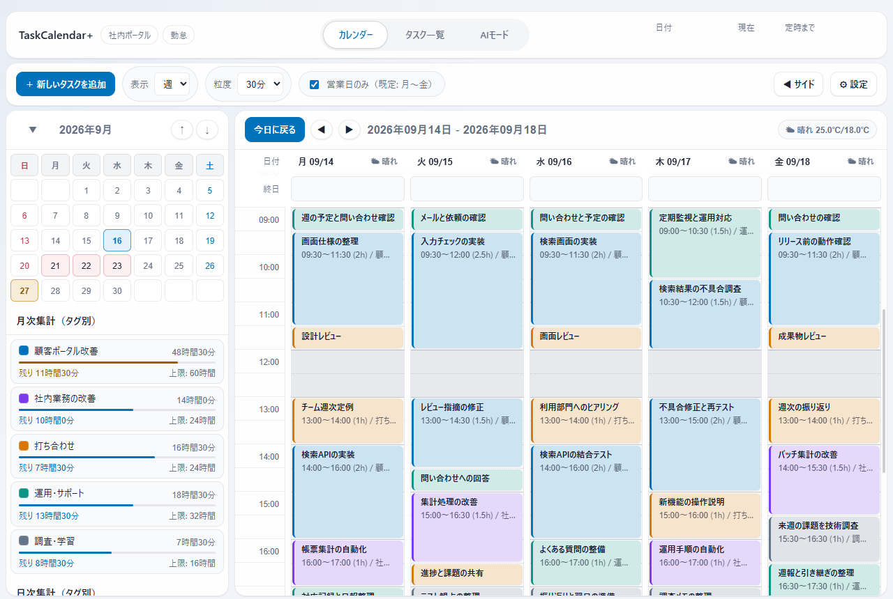
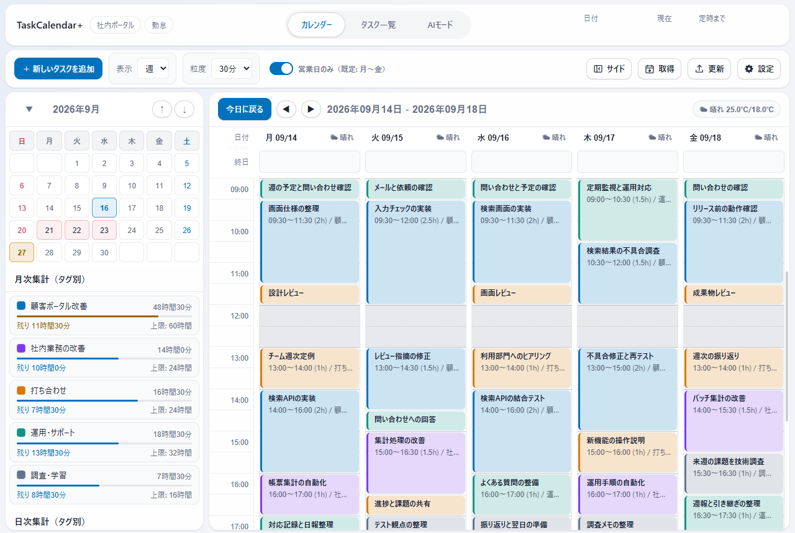
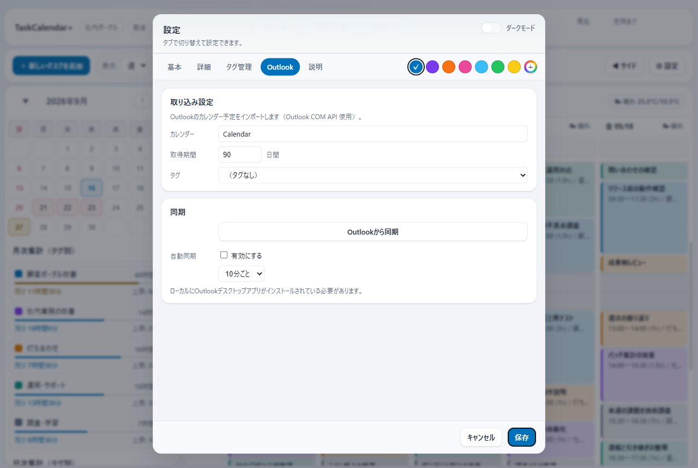
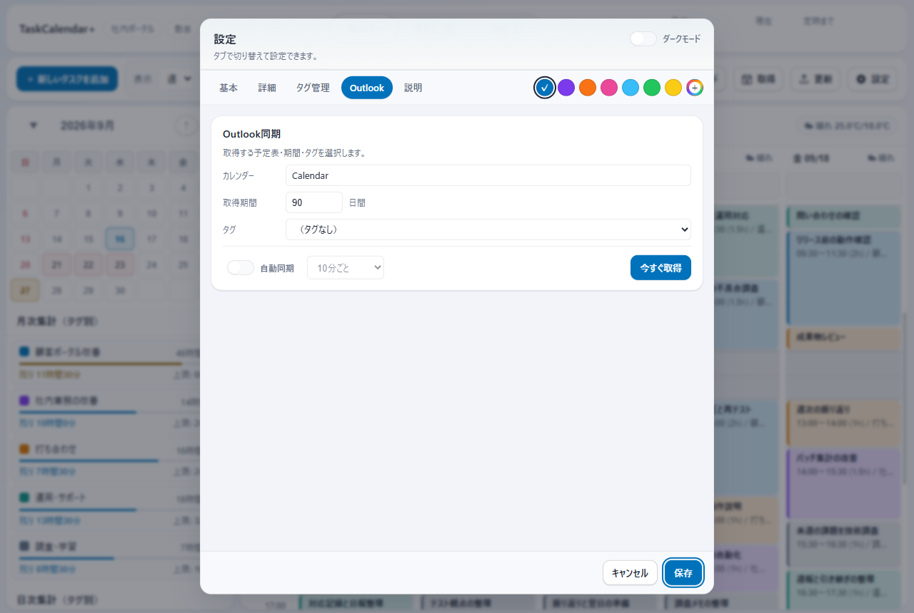
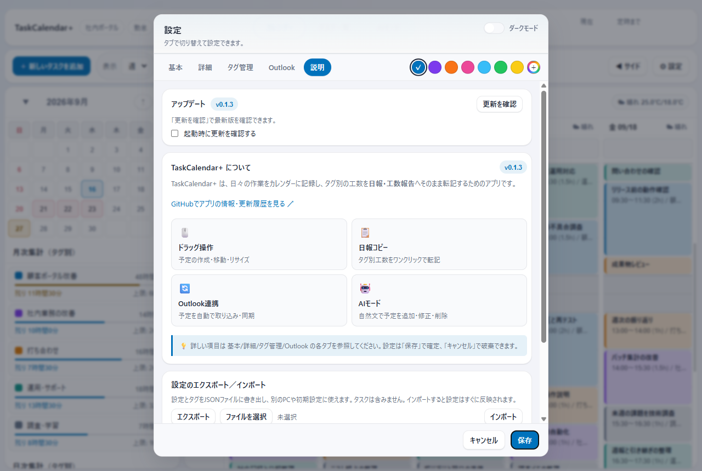
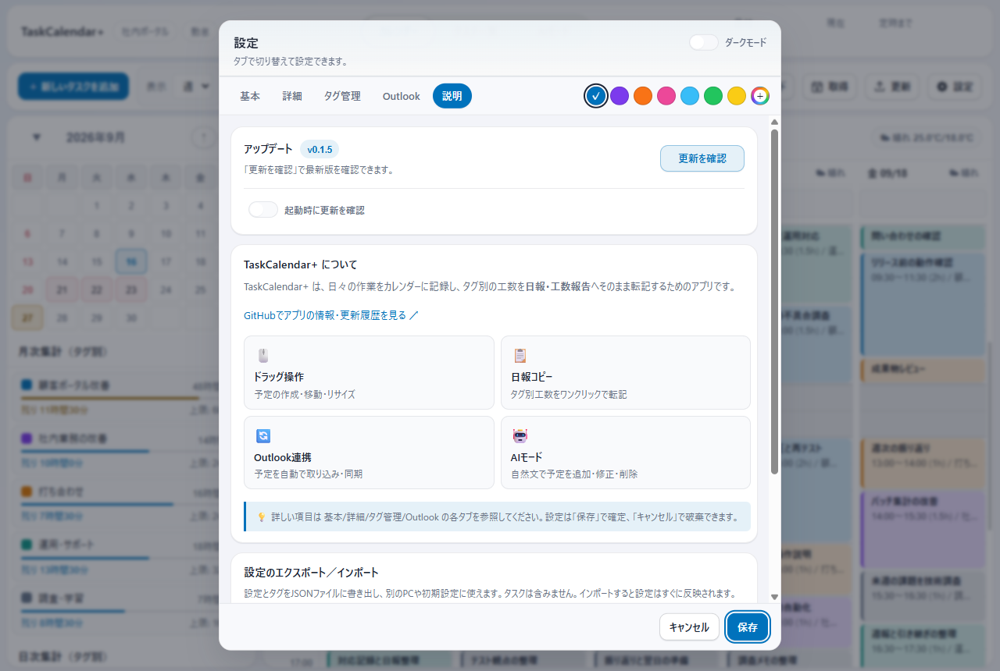

# v0.1.5 の画面変更

公開済みの v0.1.3 と v0.1.5 を、同じ架空データ・同じ画面サイズで比較しました。画像はそれぞれの配布用インストーラーに入っている実際のアプリです。

## 操作ボタンと余白

| 変更前：v0.1.3 | 変更後：v0.1.5 |
|---|---|
|  |  |

- **「サイド」「取得」「更新」「設定」**を同じ場所に並べました。アイコンだけでなく文字でも操作を確認できます。
- 「取得」でOutlookの設定を開き、「更新」で更新確認へ進めます。新しい版がある場合は更新ボタンの色が変わります。
- 上部の余白を狭め、表示・粒度の入力欄の角丸をほかの部品に合わせました。
- 「営業日のみ」を、ほかのON/OFF設定と同じスイッチにしました。予定やタグ別集計の内容は変わりません。

## Outlookの設定

| 変更前：v0.1.3 | 変更後：v0.1.5 |
|---|---|
|  |  |

- 取得条件、自動同期、手動取得を1つの枠にまとめました。
- 自動同期を共通のスイッチにし、OFFのときは間隔の選択を無効にしています。
- 手動で取り込むボタンは**「今すぐ取得」**です。結果やエラーは入力欄と分けて表示します。

## 更新の設定

| 変更前：v0.1.3 | 変更後：v0.1.5 |
|---|---|
|  |  |

- 版の表示を更新欄にまとめ、起動時の更新確認も共通のスイッチにしました。
- 設定画面を探さなくても、ツールバーの「更新」から確認できます。

## 比較条件

95件の架空の予定と5タグ、2026年9月16日を選択した週表示、ライトモード、1280×860ピクセル、倍率100%で撮影しました。比較のため、現在時刻・今日の日付・定時までの残り時間の値を非表示にし、天気は固定した検証データを表示しています。これらは撮影時だけの処理で、配布アプリの表示変更ではありません。

同じデータ保存先をv0.1.3からv0.1.5へ引き継ぎ、予定のIDと全項目、タグ、設定、日次サマリー、気づきメモが一致することを確認しました。
