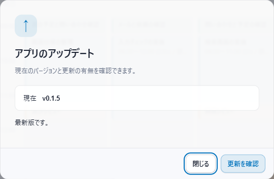
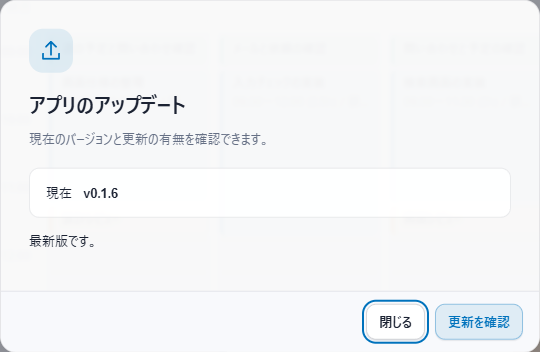
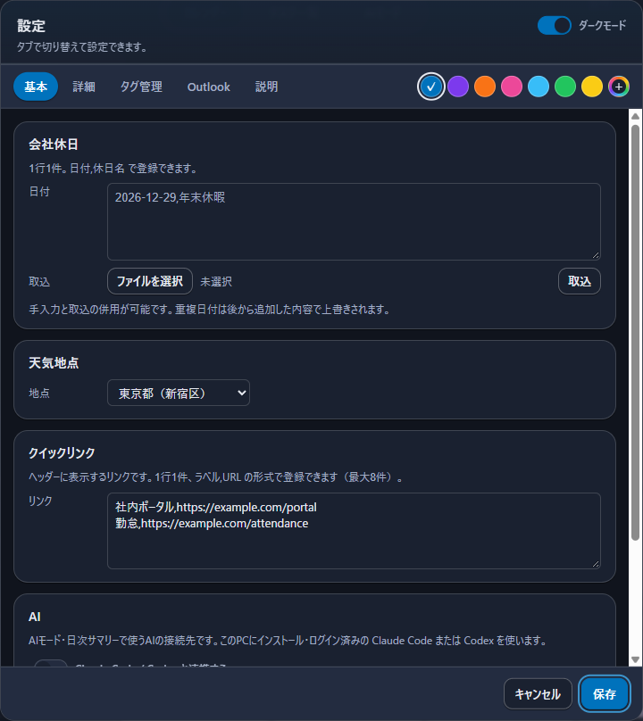
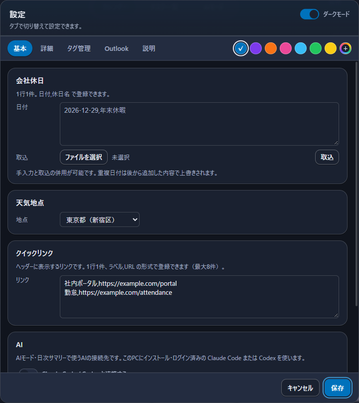

# v0.1.6 の画面変更

v0.1.5 と v0.1.6 の配布用アプリで撮影した比較です。予定や設定の操作手順は変わりません。

## アップデート画面の記号

| 変更前：v0.1.5 | 変更後：v0.1.6 |
|---|---|
|  |  |

単独の「↑」を、ツールバーの「更新」と同じ矢印アイコンにそろえました。

## 設定画面のスクロールバー

| 変更前：v0.1.5 | 変更後：v0.1.6 |
|---|---|
|  |  |

設定画面もカレンダーと同じ、細く半透明のスクロールバーにしました。ダークモードでカレンダーのスクロールバーが太く見える問題も修正し、両方の画面で同じ細さを保ちます。

画像は同じ架空データと画面サイズで撮影し、ダイアログ部分を切り出しています。ライト／ダークの色・太さ・丸みの一致と、ホイール操作によるスクロールを確認しました。
