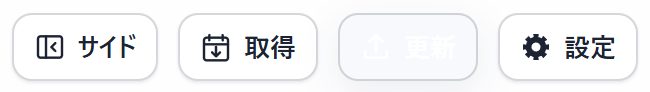
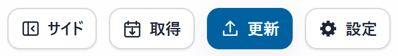
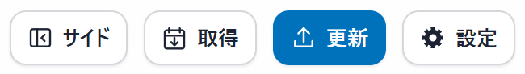

# v0.1.7 の更新ボタン

**アップデートがある状態**の「更新」ボタンを修正しました。

## ライトモードでの変更

| v0.1.6：ホバー中 | v0.1.7：ホバー中 |
|---|---|
|  |  |

以前は、ホバーすると通常ボタン用の薄い背景色が優先され、文字とアイコンだけが白く残っていました。更新ありのボタンには専用のホバー配色を使い、強調色を維持するようにしました。

## 修正後の通常時とホバー時

| 更新あり・通常 | 更新あり・ホバー中 |
|---|---|
|  |  |

標準の青の場合、マウスを重ねると背景が少し濃い青になり、文字とアイコンは白のままです。ダークモードや変更したUIカラーでも、ホバー用の背景色に合わせて読みやすい文字色を使います。

画像は各バージョンの配布用アプリを使い、比較用に同じ「更新あり」の表示状態を設定して撮影しました。カレンダー・タスク一覧・AIモードのボタンと、ライト／ダーク・11配色の表示を確認しています。
