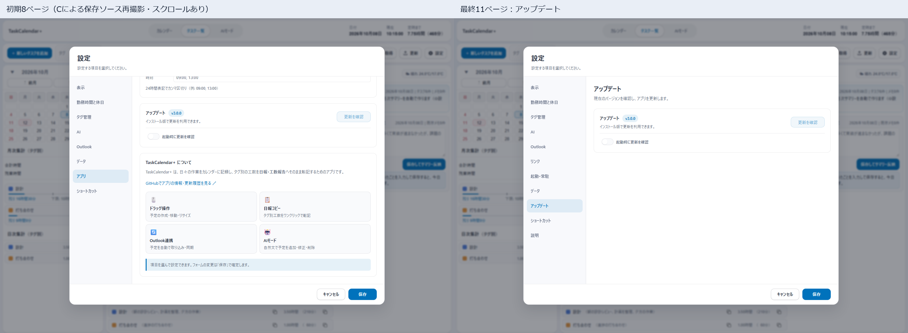
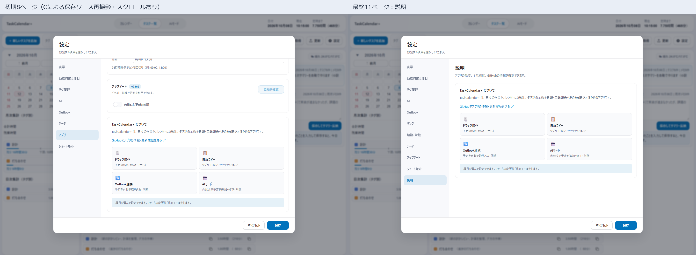

# v3.0.0 スクリーンショット（未公開）

現在の11ページ設定と主要操作の29画面です。**アプリの画面コードを隔離したChromiumで表示**し、API・ネイティブ連携・天気の応答には検証用データを使いました。Windowsアプリを再起動して撮影した画像ではありません。

1440×1000、倍率1、日時は2026年10月8日10時15分に固定しています。予定6件のうちタグ付き4件の合計は4時間30分、勤務時間9:00〜18:00の外に1時間です。タグなし2件は合計・残業に含めません。日次サイドバーは合計・残業のみ非表示で、タグ別の内訳を残しています。

実Outlookへの登録・取得、実AIへの問い合わせ、ファイル復元は行っていません。英語・韓国語でも入力された日本語の予定名とタグ名は維持します。今日への移動は既存の「今日に戻る」を使います。

| 画面 | 確認できる内容 |
|---|---|
| [週表示](images/v3.0.0-review/calendar-week.png) | 月次の合計・残業、日次のタグ別内訳、現在時刻の線 |
| [日表示](images/v3.0.0-review/calendar-day.png) | 時間帯と予定の配置 |
| [タスク一覧](images/v3.0.0-review/tasks.png) | タグなしの中立色バッジと操作アイコン |
| [複数選択](images/v3.0.0-review/tasks-selection.png) | Ctrl／Shiftによる選択と件数表示 |
| [一覧での右クリック一括操作](images/v3.0.0-review/tasks-context-bulk.png) | タグ変更・一括変更・一括削除を右クリックに集約。選択しても追加操作欄は表示しない |
| [カレンダーでの右クリック一括操作](images/v3.0.0-review/calendar-context-bulk.png) | 選択中の予定から一括変更・削除。選択件数はメニュー内に表示 |
| [一括変更](images/v3.0.0-review/task-bulk-edit.png) | 選択した予定のタグ・日付・メモの変更 |
| [タスク編集](images/v3.0.0-review/task-edit.png) | 入力欄・余白・保存と取消・Outlook登録選択 |
| [削除確認](images/v3.0.0-review/task-delete-confirm.png) | アプリ内の確認ダイアログ |
| [月選択](images/v3.0.0-review/mini-month.png) | 12か月の選択 |
| [年選択](images/v3.0.0-review/mini-year.png) | 12年の選択 |
| [右クリックのタグ選択](images/v3.0.0-review/tag-menu.png) | 背景と色見本を分けた表示 |
| [設定：表示](images/v3.0.0-settings/settings-display.png) | テーマ・カラー・言語・時間粒度・営業日のみ・天気地点 |
| [設定：勤務時間と休日](images/v3.0.0-settings/settings-work.png) | 勤務開始・終了、休憩と工数算入、会社休日 |
| [設定：タグ管理](images/v3.0.0-settings/settings-tags.png) | 追加・変更・削除、色、順序、月別工数上下限 |
| [設定：AI](images/v3.0.0-settings/settings-ai.png) | 接続先、モデル、接続設定、話し方・カスタム指示 |
| [設定：Outlook](images/v3.0.0-settings/settings-outlook.png) | 取得・同期・登録、反映状況・再試行 |
| [設定：リンク](images/v3.0.0-settings/settings-links.png) | クイックリンク、指定時刻のURL自動オープン |
| [設定：起動・常駐](images/v3.0.0-settings/settings-startup.png) | ログイン時起動、トレイ格納、起動時の表示状態 |
| [設定：データ](images/v3.0.0-settings/settings-data.png) | 設定移行、全データのバックアップ・復元 |
| [設定：アップデート](images/v3.0.0-settings/settings-updates.png) | 現在のバージョン、更新確認・実行、起動時の更新確認 |
| [設定：ショートカット](images/v3.0.0-settings/settings-shortcuts.png) | キー操作と使用条件 |
| [設定：説明](images/v3.0.0-settings/settings-info.png) | アプリ概要、機能紹介、GitHubへのリンク |
| [ダークモード：一覧](images/v3.0.0-review/tasks-dark.png) | 暗い配色での一覧と集計 |
| [ダークモード：一覧のメニュー](images/v3.0.0-review/tasks-context-dark.png) | 暗い配色での右クリックメニュー |
| [ダークモード：カレンダーのメニュー](images/v3.0.0-review/calendar-context-dark.png) | 暗い配色での右クリックメニュー |
| [ダークモード：勤務時間](images/v3.0.0-settings/settings-work-dark.png) | 暗い配色での設定 |
| [英語](images/v3.0.0-review/calendar-en.png) | 英語のUIと日本の地域設定 |
| [韓国語](images/v3.0.0-review/calendar-ko.png) | 韓国語のUIと日本の地域設定 |

## 設定画面の変更前後

従来の8ページから11ページへ整理しました。「アップデート」と「説明」を分け、クイックリンクとURL自動オープンを「リンク」にまとめています。左は変更前、右は変更後です。

[全11ページの比較・命名整理・検証結果](reviews/v3.0.0-settings-mece.md)を確認できます。その後の純粋な内部整理では45状態の画素差分が0でした。旧8ページ化やタスク編集の比較は[前回の報告](reviews/v3.0.0-refactor.md)に残しています。

## 代表画面

### 週表示

### 複数選択

### 一括変更

### 削除確認

### AI設定

### データ設定

### 英語

### 韓国語

設定の最新撮影情報は[設定capture.json](images/v3.0.0-settings/capture.json)に記録しています。設定以外の既存画面の撮影情報は[gallery.json](images/v3.0.0-review/gallery.json)、追加4画面は[extra-capture.json](images/v3.0.0-review/extra-capture.json)、右クリック一括操作2画面は[context-bulk-capture.json](images/v3.0.0-review/context-bulk-capture.json)に記録しています。[隔離した撮影ハーネス](../scripts/refactor-20261008-harness.mjs)を使用しました。旧8ページの設定画像は `images/v3.0.0-review/`、過去のネイティブ撮影画像は `images/v3.0.0/` に履歴として残しています。

[READMEへ戻る](../README.md)
