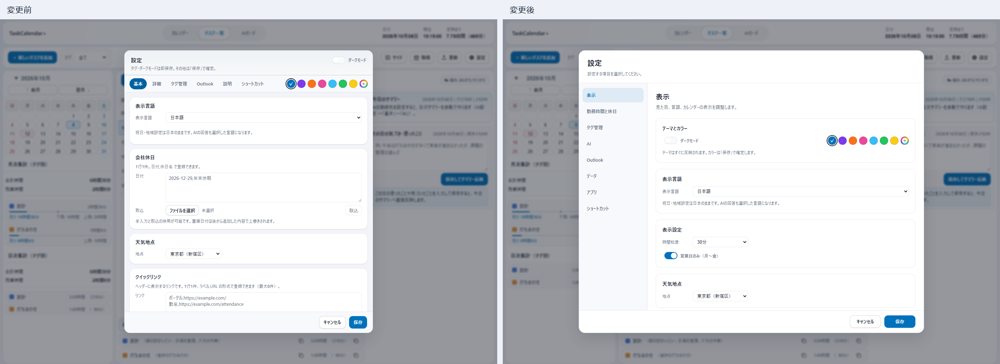
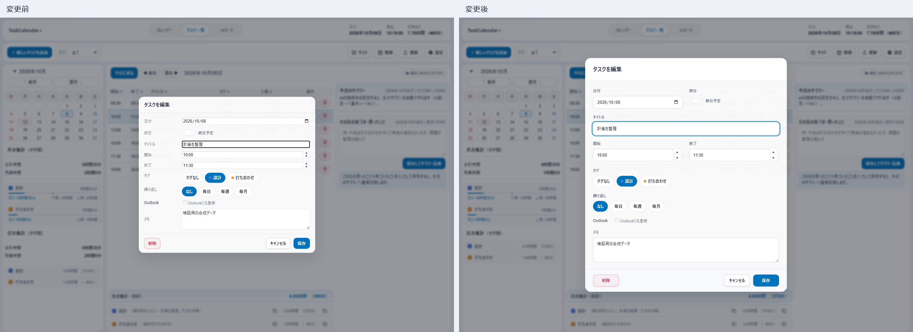
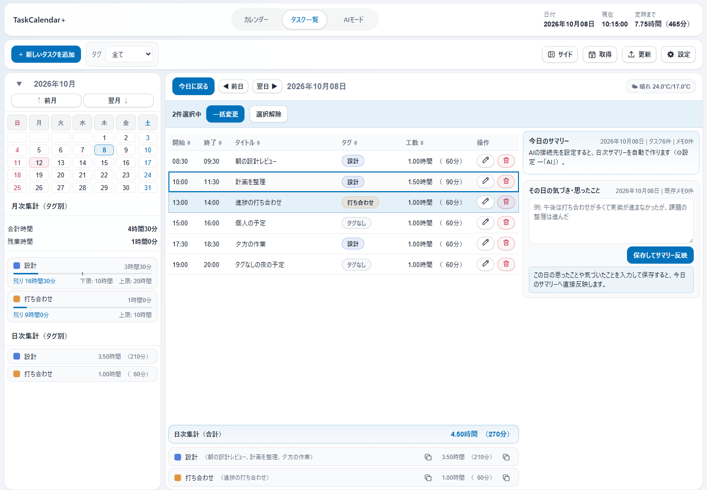
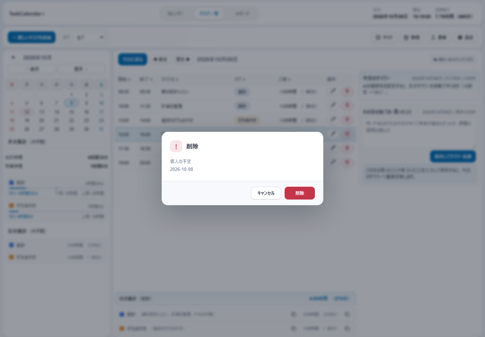
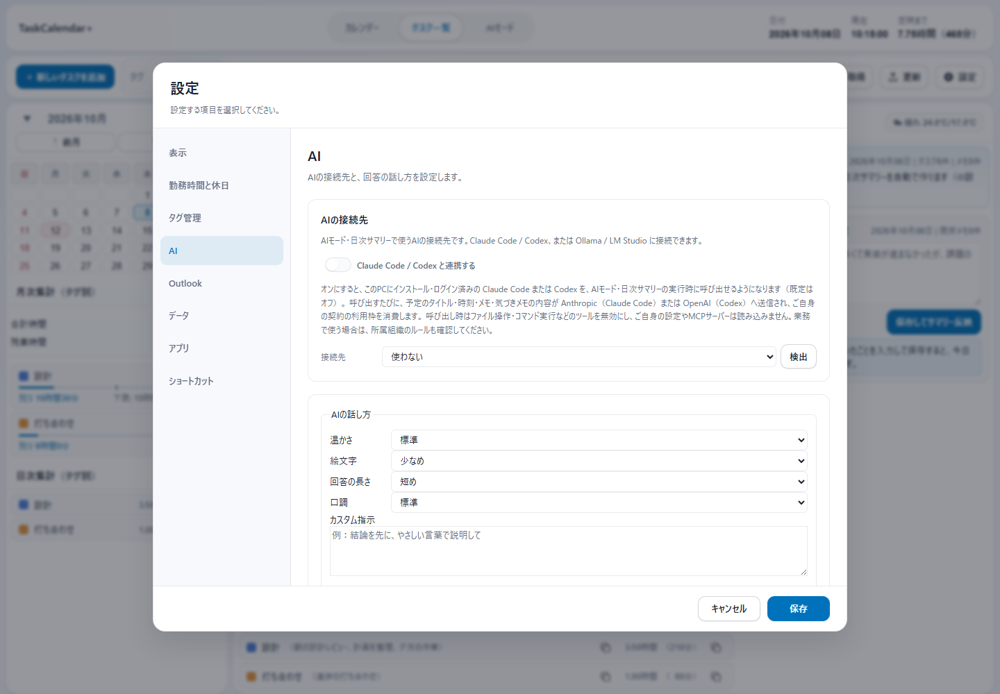
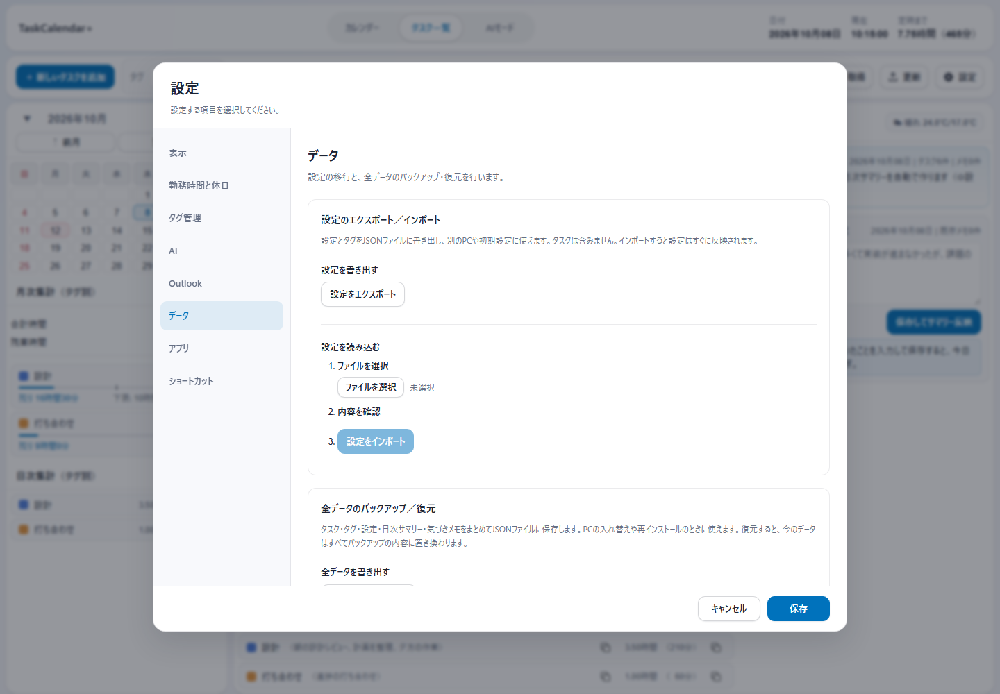
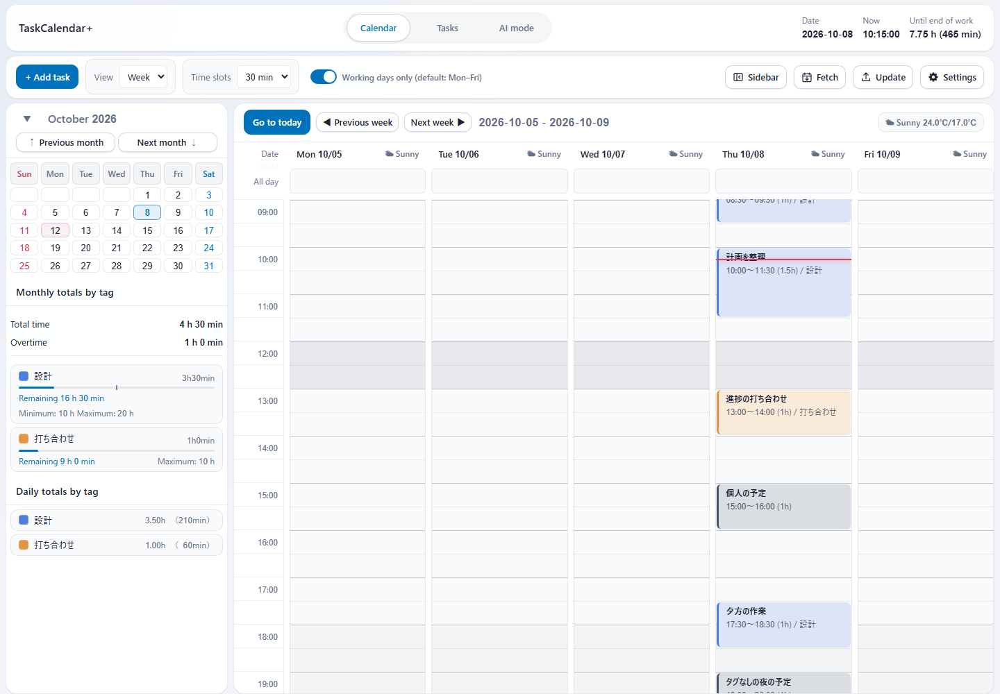
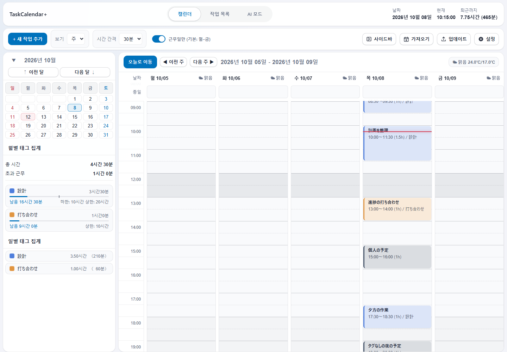

# v3.0.0 スクリーンショット（未公開）

追加Issueの対応後の22画面です。**アプリの画面コードを隔離したChromiumで表示**し、API・ネイティブ連携・天気の応答には検証用データを使いました。Windowsアプリを再起動して撮影した画像ではありません。

1440×1000、倍率1、日時は2026年10月8日10時15分に固定しています。予定6件のうちタグ付き4件の合計は4時間30分、勤務時間9:00〜18:00の外に1時間です。タグなし2件は合計・残業に含めません。日次サイドバーは合計・残業のみ非表示で、タグ別の内訳を残しています。

実Outlookへの登録・取得、実AIへの問い合わせ、ファイル復元は行っていません。英語・韓国語でも入力された日本語の予定名とタグ名は維持します。今日への移動は既存の「今日に戻る」を使います。

| 画面 | 確認できる内容 |
|---|---|
| [週表示](images/v3.0.0-review/calendar-week.png) | 月次の合計・残業、日次のタグ別内訳、現在時刻の線 |
| [日表示](images/v3.0.0-review/calendar-day.png) | 時間帯と予定の配置 |
| [タスク一覧](images/v3.0.0-review/tasks.png) | タグなしの中立色バッジと操作アイコン |
| [複数選択](images/v3.0.0-review/tasks-selection.png) | Ctrl／Shiftによる選択と件数表示 |
| [一括変更](images/v3.0.0-review/task-bulk-edit.png) | 選択した予定のタグ・日付・メモの変更 |
| [タスク編集](images/v3.0.0-review/task-edit.png) | 入力欄・余白・保存と取消・Outlook登録選択 |
| [削除確認](images/v3.0.0-review/task-delete-confirm.png) | アプリ内の確認ダイアログ |
| [月選択](images/v3.0.0-review/mini-month.png) | 12か月の選択 |
| [年選択](images/v3.0.0-review/mini-year.png) | 12年の選択 |
| [右クリックのタグ選択](images/v3.0.0-review/tag-menu.png) | 背景と色見本を分けた表示 |
| [設定：表示](images/v3.0.0-review/settings-general.png) | テーマ・配色・表示言語・カレンダー |
| [設定：勤務時間と休日](images/v3.0.0-review/settings-advanced.png) | 勤務時間・休憩・会社休日 |
| [設定：タグ管理](images/v3.0.0-review/settings-tags.png) | タグと工数の設定 |
| [設定：AI](images/v3.0.0-review/settings-ai.png) | 接続先とAIの話し方 |
| [設定：Outlook](images/v3.0.0-review/settings-outlook.png) | 取得方法・期間・登録の既定値 |
| [設定：データ](images/v3.0.0-review/settings-about.png) | 書き出し・読み込み・復元の入口 |
| [設定：アプリ](images/v3.0.0-review/settings-app.png) | 起動・常駐・更新・クイックリンク |
| [設定：ショートカット](images/v3.0.0-review/settings-shortcuts.png) | キー操作の一覧 |
| [ダークモード：一覧](images/v3.0.0-review/tasks-dark.png) | 暗い配色での一覧と集計 |
| [ダークモード：勤務時間](images/v3.0.0-review/settings-work-dark.png) | 暗い配色での設定 |
| [英語](images/v3.0.0-review/calendar-en.png) | 英語のUIと日本の地域設定 |
| [韓国語](images/v3.0.0-review/calendar-ko.png) | 韓国語のUIと日本の地域設定 |

## UI変更の前後

設定を目的別の8ページに分け、タスク編集では入力欄と操作の間隔を整理しました。同じ画面サイズ・合成データで撮影した画像を左右に並べています。画像内の画面は加工せず、見出しと間隔だけを加えています。

これは機能改善の前後です。その後の純粋なリファクタリングでは、別に固定した18画面が画素単位で一致しています。[比較・計測報告](reviews/v3.0.0-refactor.md)を参照してください。

## 代表画面

### 週表示

### 複数選択

### 一括変更

### 削除確認

### AI設定

### データ設定

### 英語

### 韓国語

18画面の撮影情報は[gallery.json](images/v3.0.0-review/gallery.json)、追加4画面は[extra-capture.json](images/v3.0.0-review/extra-capture.json)に記録しています。[隔離した撮影ハーネス](../scripts/refactor-20261008-harness.mjs)を使用しました。過去のネイティブ撮影画像は `images/v3.0.0/` に履歴として残しています。

[READMEへ戻る](../README.md)
